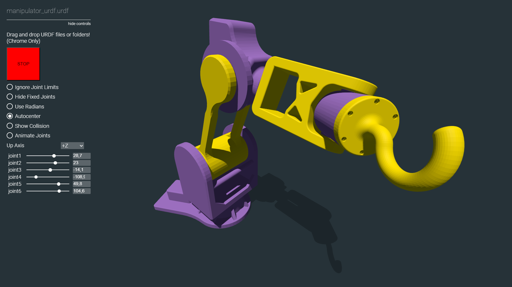

# Web interface manipulation

Целью данного проекта являлось создание демонстрационного стенда для освещения деятельности кружка перед поступившими первокурсниками 

В ходе выполения задачи был создан веб-интерфейс для ручного управления каждой из осей робота. Интерфейс имеет возможность отображения актуального состояния робота, которое он строит, используя URDF модель робота

   

