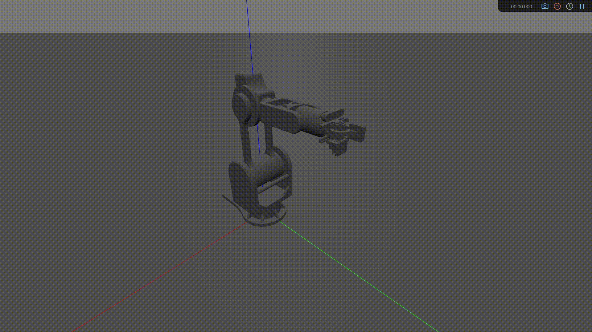

# MEPhI_ARM

   

MEPhI_ARM is a research project that is being created by the student association "Engi Teams", MEPhI university.  

Our robot is a 3D-printed desktop robotics arm, powered by stepper motors. When creating the design, aspects such as the cheapness of the design and the prevalence of components were taken into account, which eventually made the whole robot affordable. 

Follow us on [Telegram](https://t.me/engistories) and [VK](https://vk.com/engiteam.mephi)<b />

# Software Development Kit

  We use [Robotics Toolbox](https://github.com/petercorke/robotics-toolbox-python) for trajectory computing, [Swift](https://github.com/jhavl/swift) for enviroment simulation, [OpenCV](https://github.com/opencv/opencv) for computer vision 
  We have the intention to integrate [ROS2](https://github.com/ros2) and [Gazebo](https://github.com/gazebosim) into our stack.

  

 
# Links

  -[Manipulator specifications](https://docs.google.com/spreadsheets/d/1I2XZErj4YQ8Yl8tPQ1UcFLSMpRR4VvGe/edit?gid=242990879#gid=242990879) 
  -[If you want to Source all the parts yourself and build your own](https://drive.google.com/drive/folders/1ZJRR6bhaU4pdOjzauf-HGAITrqvZO9AC) 
  -[The schematic of our electronics](https://drive.google.com/drive/folders/1JxWSGcyZVD6layxN63lFpgcJdK0dmDxY?usp=sharing) 

